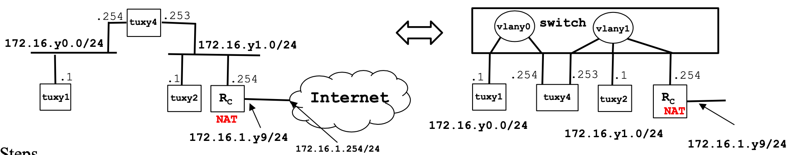

# Comandos para configurar uma maquina RCOM
---
## In the begging of each class, clean the tuxs
---

Connect the TUXs on the switch that connects to the internet in the 5.1 socket.

Change between computers(tux5s)
    1 - Double click on Scroll Lock
    2 - Click in the number of the tux that you want to select(2,3,4)
    3 - Press Enter

Inside the TUX
    1 - Execute the command in shell
    ~~~~ shell
    $ updateimage
    ~~~~

Em resumo: Conectar a rede do laboratorio, realizar a update e limpar os dispositivos, depois desconectar a rede

## EXPERIMENT 01
----------------

1. Disconnect switch from netlab and connect tux computers
2. Configure tux53 and tux54 using ifconfig and route commands
    - activar interface eth0
        root# ifconfig eth0 up
    - listar configurações actuais das interfaces de rede
        root# ifconfig

3. Register the IP and MAC addresses of network interfaces
    - tux3
        - configurar eth0 com endereço 172.16.5.1 e máscara 24 bits
            root# ifconfig eth0 172.16.5.1/24
        - IP: 172.16.5.1
        - MAC: 00:21:5A:61:2D:72
    - tux4
        - configurar eth0 com endereço 172.16.5.254 e máscara 24 bits
            root# ifconfig eth0 172.16.5.254/24
        - IP: 172.16.5.254
        - MAC: 00:21:5A:C3:78:70
4. Use ping command to verify connectivity between these computers [DONE]
    - tux3
        root# ping 172.16.5.254
    - tux4
        root# ping 172.16.5.1
5. Inspect forwarding (route –n) and ARP (arp –a) tables [DONE]
    TODO: Update with images what happened
6. Delete ARP table entries in tux51 (arp –d ipaddress) [DONE]
7. Start Wireshark in tux53.eth0 and start capturing packets []

8. In tux53, ping tux54 for a few seconds []

9. Stop capturing packets

10. Save log study it at home

» What are the ARP packets and what are they used for?

- The arp packets are used to resolve the name between the IP address and the MAC address making the correct association.
» What are the MAC and IP addresses of ARP packets and why?

- They are the MAC and IP adressess of the PC that are connected in the same network.
    In the request message we have the IP and MAC address from the Device that make the request, and the IP address that you want to find the MAC address associated. In the request message the field for the MAC address for the target is only 0s, in the response message this field is fullfilled with the correct MAC address.

» What packets does the ping command generate?

- In the wireshark generates packets from the ICMP protocol with a message for request and a message for reply.

» What are the MAC and IP addresses of the ping packets?

- The ones of the Source and Destination devices involved in the ping. Where the source is where the ping command are executed and the destination is the device that are beeing tested the connection, the endpoint.

» How to determine if a receiving Ethernet frame is ARP, IP, ICMP?

- From the field Type, where is indicated an Hexadecimal number witch indicates the type of protocol is beeing use.
- For example:
        If the type is 0x0800 is the ICMP and if is 0x0806 the type is the ARP protocol.

» How to determine the length of a receiving frame?

- Not sure by observation but I have a notion that is a value sended in the header of the frame.

» What is the loopback interface and why is it important?

- The loopback interface is usefull to keep the mac address of the device and to make tests in the own device if you want to test of implement a functionality, or to ping the own device to check some irregularities.

## EXPERIMENT 02
----------------

1. Configure tux52 and annotate its IP and MAC addresses

After the update image 

$ ifconfig eth0 up
$ ifconfig eth0 <ipnumber/24(bits utilizados para rede)>
- NOTE: 32 - 24 = 8 bits utilizado para codificar os endereços na rede, resultando em 256 endereços - 2(Broadcast .255 and switch .0)

Tux net configuration (addresses)

    - tux2
        IP: 172.16.51.1/24:8
        MAC: 00:21:5A:61:2F:D6
    - tux3
        IP: 172.16.50.1/24:4
        MAC: 00:21:5A:61:2D:72
    - tux4
        IP: 172.16.50.254/24:5
        MAC: 00:21:5A:C3:78:70
    
2. Create vlany0 in the switch and add corresponding ports
3. Create vlany1 and add corresponding port

- Connect the S0 of the tux3 to the T3 and the switch console->T4 and inside the GKterm (/dev/ttyS0) access the switch and execute the commands:

First entrance on the switch:
~~~shell
tux-sw5>enable
password: 8nortel
~~~
Vlan 0 configuration
~~~shell
tux-sw5# configure terminal
tux-sw5# vlan 50
tux-sw5# end
tux-sw5# show vlan id 50
~~~
Vlan 1 configuration
~~~shell
tux-sw5# configure terminal
tux-sw5# vlan 51
tux-sw5# end
tux-sw5# show vlan id 50
~~~
Adding ports 4 e 5 to vlan 0
~~~shell
tux-sw5# configure terminal
tux-sw5# interface fastethernet 0/5
tux-sw5# switchport mode access
tux-sw5# switchport access vlan 50
tux-sw5# end
tux-sw5# show running-config interface fastethernet 0/5 

Output: 
    Building configuration...

    Current configuration: 84 bytes
    !
    interface FastEthernet 0/5
        switchport access vlan 50
        switchport mode access
    end

tux-sw5# show interfaces fastethernet 0/5 switchport
Output: IMAGE

tux-sw5# configure terminal
tux-sw5# interface fastethernet 0/4
tux-sw5# switchport mode access
tux-sw5# switchport access vlan 50
tux-sw5# end
tux-sw5# show running-config interface fastethernet 0/4

Output: 
    Building configuration...

    Current configuration: 84 bytes
    !
    interface FastEthernet 0/4
        switchport access vlan 50
        switchport mode access
    end

tux-sw5# show interfaces fastethernet 0/4 switchport

Output: IMAGE
~~~

Adding ports 8 to vlan 1
~~~shell
tux-sw5# configure terminal
tux-sw5# interface fastethernet 0/8
tux-sw5# switchport mode access
tux-sw5# switchport access vlan 51
tux-sw5# end
tux-sw5# show running-config interface fastethernet 0/8

Output: 
    Building configuration...

    Current configuration: 84 bytes
    !
    interface FastEthernet 0/8
        switchport access vlan 51
        switchport mode access
    end

tux-sw5# show interfaces fastethernet 0/8 switchport

Output: IMAGE
~~~

4. Start capture at tux53.eth0 [DONE]
5. In tux53, ping tux54 and then ping tux52 [DONE]
6. Stop capture and save log [DONE]
7. Start new captures in tux53.eth0, tux54.eth0, and tux52.eth0 [DONE]
8. In tux53, do ping broadcast (ping –b 172.16.50.255) for a few seconds [DONE]

NOTE: execute this in the tux54
» echo 0 > /proc/sys/net/ipv4/icmp_echo_ignore_broadcasts

9. Observe results, stop captures and save logs [DONE]
10. Repeat steps 7, 8 and 9, but now do ping broadcast in tux52 (ping –b 172.16.51.255)

Questions
» How to configure vlan50?
    First we connect the serial port of the PC in the switch serial port for configuration
    At the GtkTerm we press enter and after that is just to execute the commands as is showed bellow:
    ~~~shell
    tux-sw5>enable
    password: 8nortel
    ~~~
    Vlan 0 configuration
    ~~~shell
    tux-sw5# configure terminal
    tux-sw5# vlan 50
    tux-sw5# end
    tux-sw5# show vlan id 50
» How many broadcast domains are there? How can you conclude it from the logs?

## EXPERIMENT 03
----------------

Tux net configuration (addresses)
    - tux2
        - IP: 172.16.51.1/24:8
        - MAC: 00:21:5A:61:2F:D6
    - tux3
        - IP: 172.16.50.1/24:4
        - MAC: 00:21:5A:61:2D:72
    - tux4
        - eth0
            - IP: 172.16.50.254/24:8
            - MAC: 00:21:5A:C3:78:70
        - eth1
            - IP: 172.16.51.253/24:9
            - MAC: 00:C0:DF:08:D5:B0

tux-sw5# configure terminal
tux-sw5# interface fastethernet 0/9
tux-sw5# switchport mode access
tux-sw5# switchport access vlan 51
tux-sw5# end
tux-sw5# show running-config interface fastethernet 0/9

Output: 
    Building configuration...

    Current configuration: 84 bytes
    !
    interface FastEthernet 0/9
        switchport access vlan 51
        switchport mode access
    end

tux-sw5# show interfaces fastethernet 0/9 switchport

Output: IMAGE
~~~

1. Transform tux54 (linux machine) into a router

– Configure also tux54.eth1
    ifconfig eth1 up
    ifconfig eth1 172.16.51.253/24
– Enable IP forwarding
    $ echo 1 > /proc/sys/net/ipv4/ip_forward
– Disable ICMP echo-ignore-broadcast
    $ echo 0 > /proc/sys/net/ipv4/icmp_echo_ignore_broadcasts
2. Observe MAC addresses and IP addresses in tux54.eth0 and tux54.eth1 [DONE]

3. Reconfigure tux53 and tux52 so that each of them can reach the other [DONE]

4. Observe the routes available at the 3 tuxes (route –n)
5. Start capture at tux53
6. From tux51, ping the other network interfaces (171.16.50.254, 171.16.y1.253, 171.16.y1.1) and verify if there is connectivity.
7. Stop capture and save logs
8. Start capture in tux54; use 2 instances of Wireshark, one per network interface
9. Clean the ARP tables in the 3 tuxes
10. In tux51, ping tux52 for a few seconds.
11. Stop captures in tux54 and save logs

## EXPERIMENT 04
----------------

- Configure the port 20 of the switch in mode access to vlan 51
    tux-sw5# configure terminal
    tux-sw5# interface fastethernet 0/20
    tux-sw5# switchport mode access
    tux-sw5# switchport access vlan 51
    tux-sw5# end
    tux-sw5# show running-config interface fastethernet 0/20

1. Configure commercial router RC and connect it (no NAT) to the lab network (172.16.1.0/24)

    Configure route
    add route tux2 -> vlan0
    $ route add -net 172.16.50.0/24 gw 172.16.51.253
    add route tux3 -> vlan1
    $ route add -net 172.16.51.0/24 gw 172.16.50.254

    In page 45 execute this commands:
    » tux-rtr5# config t
    » tux-rtr5# interface gigabitethernet 0/0
    » tux-rtr5# ip address 172.16.51.254 255.255.255.0 
    » no shutdown
    » tux-rtr5# exit
    » tux-rtr5# show interface gigabitethernet 0/0

    » tux-rtr5# config t
    » tux-rtr5# interface gigabitethernet 0/1
    » tux-rtr5# ip address 172.16.1.59 255.255.255.0 
    » no shutdown
    » tux-rtr5# exit
    » tux-rtr5# show interface gigabitethernet 0/1

route add -net 172.16.51.0/24 gw 172.16.50.254

2. Verify routes
– tuxy4 as default router of tuxy1; 
- Rc as default router for tuxy2 and tuxy4
– Routes for 172.16.y0.0/24 in tuxy2 and Rc
3. Using ping commands and wireshark, verify if tux53 can ping all the network interfaces of tuxy4, tuxy2 and Rc
4. In tuxy2
– Do: echo 0 > /proc/sys/net/ipv4/conf/eth0/accept_redirects and echo 0 > /proc/sys/net/ipv4/conf/all/accept_redirects
– remove the route to 172.16.y0.0/24 via tuxy4
– In tuxy2, ping tuxy1
– Using capture at tuxy2, try to understand the path followed by ICMP ECHO and ECHO-REPLY packets (look at MAC addresses)
– In tuxy2, do traceroute tuxy1
– In tuxy2, add again the route to 172.16.y0.0/24 via tuxy4 and do traceroute tuxy1
– Activate the acceptance of ICMP redirect at tuxy2 when there is no route to 172.16.y0.0/24 via tuxy4 and try to understand what happens
5. In tuxy1, ping the router of the lab I.321 (172.16.1.254) and try to understand what happens
6. Add NAT functionality to router Rc
7. In tuxy1 ping 172.16.1.254, verify if there is connectivity, and try to understand what happens
